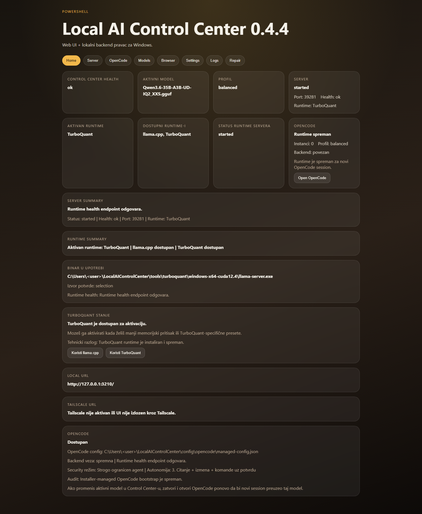
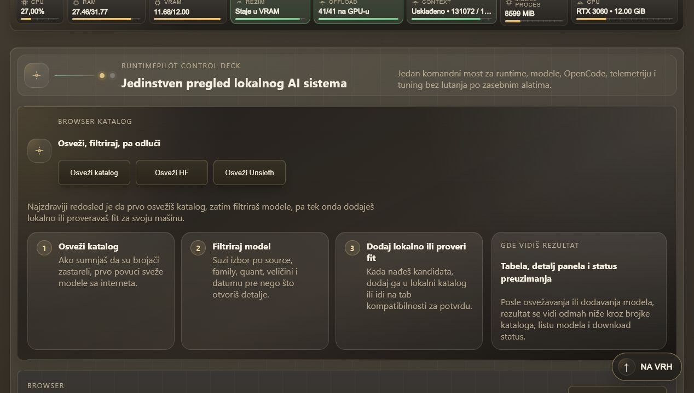
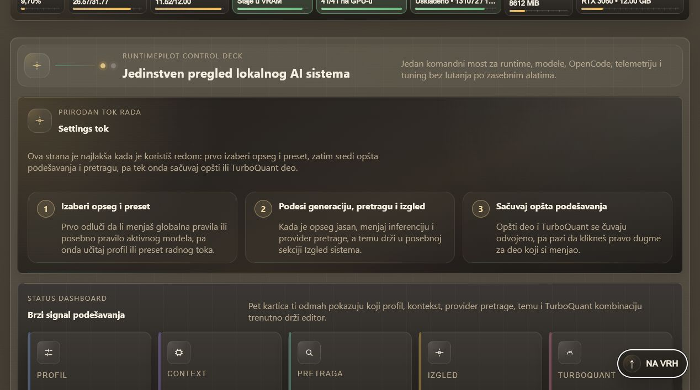

# Local AI Control Center Stable

Windows installer and local control panel for running `llama.cpp`, `TurboQuant`, GGUF models, and `OpenCode` from one installer-managed product.

[](https://github.com/joes021/local-ai-control-center-stable/releases/latest)
[](https://github.com/joes021/local-ai-control-center-stable/releases/latest)
[](https://github.com/joes021/local-ai-control-center-stable)

## Download

Primary end-user artifact:

- [Download the latest Windows installer](https://github.com/joes021/local-ai-control-center-stable/releases/latest)

Current release:

- [LocalAIControlCenterSetup-v0.4.4.exe](https://github.com/joes021/local-ai-control-center-stable/releases/download/v0.4.4/LocalAIControlCenterSetup-v0.4.4.exe)

The Windows product is intended to be launched with a double-click. No ZIP extraction and no manual PowerShell command are required for the packaged installer path.

## What You Get

- a single Windows `.exe` installer
- bundled runtime preparation for `llama.cpp`
- packaged Windows `TurboQuant` path for supported NVIDIA x64 systems
- installer-managed `OpenCode` bootstrap and launch
- a local control panel at `http://127.0.0.1:3210/`
- local model catalog plus an internet-backed GGUF browser
- truthful logs, reports, and runtime status

## Product Screens

### Home



### Browser



### Settings



## What This Repository Delivers

This repository focuses on one product path:

1. install the Windows product reliably
2. prepare runtime artifacts and starter models truthfully
3. open a usable local control panel
4. manage models and launch `OpenCode` against the installer-managed runtime

The current Windows milestone includes:

- numbered installer prompts with clear final outcome reporting
- starter model tiers for `recommended-6gb`, `recommended-12gb`, and `recommended-24gb`
- pinned runtime payload setup and verification
- durable runtime endpoint, active-model, and model-locations config
- installer-managed `OpenCode` bootstrap and live-route verification
- packaged Windows `TurboQuant` install path with required OpenSSL sidecar DLLs
- Start Menu, Desktop, and uninstall shell integration
- truthful runtime, model, `OpenCode`, and `TurboQuant` status in the panel
- Browser table for `Hugging Face` and `Unsloth` GGUF discovery
- installer-managed model download worker with progress tracking and error reporting
- settings, presets, and runtime preferences persisted through the control panel

The current default `recommended-6gb` starter model is `gemma-4-E4B-it-Q4_K_M.gguf`.

## Installed Product Layout

After a successful Windows install, the product provides:

- control panel URL: `http://127.0.0.1:3210/`
- runtime endpoint: installer-managed local endpoint
- panel launcher: `control-center/Open-Control-Center.cmd`
- panel host: `control-center/LocalAIControlCenterPanel.exe`
- `OpenCode` launcher: `control-center/Open-OpenCode.cmd`
- Start Menu folder: `Local AI Control Center`

The control panel currently exposes:

- `Home`
- `Server`
- `OpenCode`
- `Models`
- `Browser`
- `Settings`
- `Logs`
- `Repair`

## Models vs Browser

The product keeps these flows separate on purpose:

- `Models`
  - local catalog, active model switching, local GGUF import, and direct registry management
- `Browser`
  - internet-backed GGUF discovery from `Hugging Face` and `Unsloth`, compatibility checks, and installer-managed download actions

## Build From Source

Editable development install:

```powershell
python -m pip install -e .[dev]
```

Run tests:

```powershell
python -m pytest
```

Build the packaged Windows installer:

```powershell
powershell -ExecutionPolicy Bypass -File .\packaging\build_windows_installer.ps1
```

Manual bootstrap from a clean checkout:

```powershell
powershell -ExecutionPolicy Bypass -File .\bootstrap\install.ps1
```

## Repository Layout

- `bootstrap/`
  - thin PowerShell launcher for source checkout bootstrap
- `frontend/`
  - control panel frontend
- `src/local_ai_control_center_installer/`
  - installer, runtime orchestration, packaged backend, manifests, and release logic
- `tests/`
  - installer, runtime, control-panel, and packaging regression coverage
- `docs/requirements/PRODUCT_REQUIREMENTS.md`
  - locked product requirements

## Current Scope

Priority order:

1. Windows
2. Ubuntu x86_64
3. Ubuntu arm64

This repository currently claims a complete Windows installer + runtime + control-panel milestone for its own scope.

This repository does not yet claim:

- Linux parity
- a finished Ubuntu product path
- every possible GGUF runtime variant as production-safe by default

## Working Principle

- stable core first
- shell and polish second
