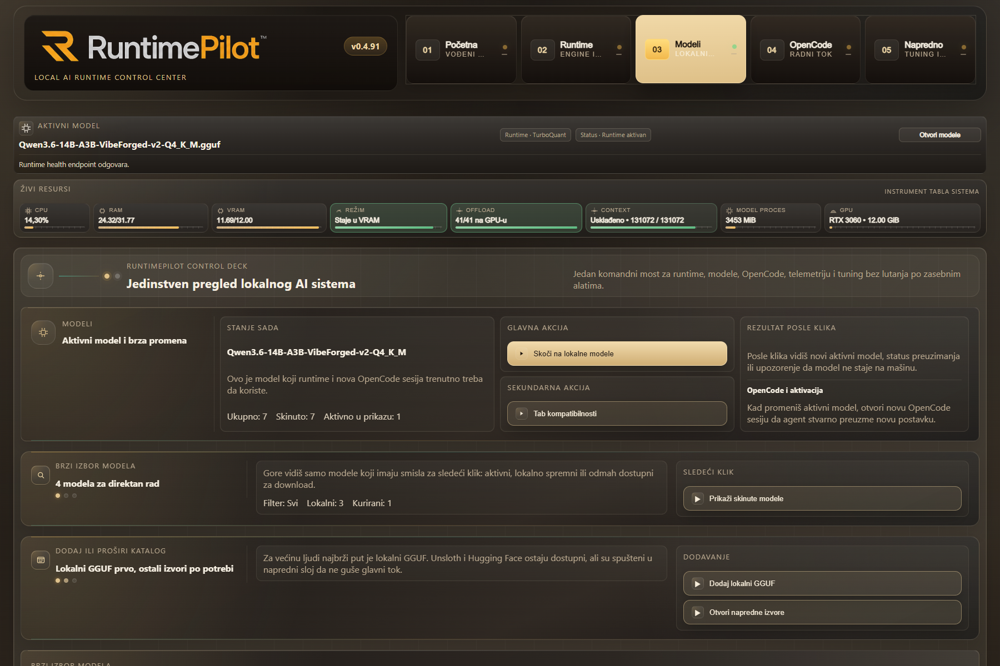
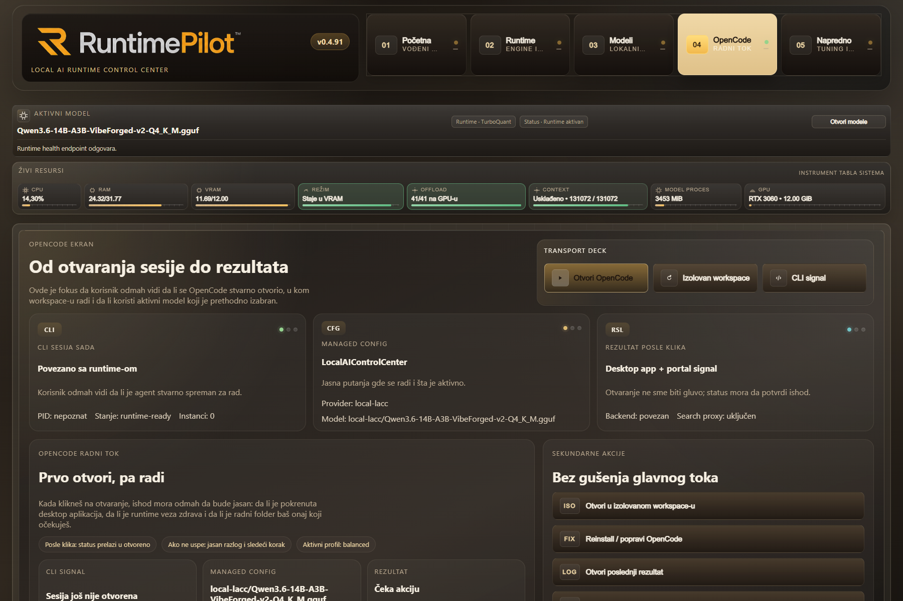

# RuntimePilot Stable

Installer-managed local control panel for running `llama.cpp`, `TurboQuant`, GGUF models, and `OpenCode`, with a finished Windows path and an Ubuntu x86_64 port in progress.

[](https://github.com/joes021/local-ai-control-center-stable/releases/latest)
[](https://github.com/joes021/local-ai-control-center-stable/releases/latest/download/RuntimePilotSetup-latest.exe)
[](https://github.com/joes021/local-ai-control-center-stable/releases/latest)
[-d29922)](https://github.com/joes021/local-ai-control-center-stable)
[](https://github.com/joes021/local-ai-control-center-stable)

## What RuntimePilot Is

RuntimePilot is a local AI control center built around one clear path:

1. start a local runtime like `llama.cpp` or `TurboQuant`
2. choose a local GGUF model
3. use that model through `OpenCode`

The goal is to remove guesswork. Instead of manually stitching together runtimes, model folders, context limits, and agent setup, the installer gives you one local portal for launch, monitoring, model browsing, compatibility checks, benchmarking, search, and `OpenCode` handoff.

## Download

Start here:

- [Download the latest Windows setup directly](https://github.com/joes021/local-ai-control-center-stable/releases/latest/download/RuntimePilotSetup-latest.exe)
- [Open the latest release page](https://github.com/joes021/local-ai-control-center-stable/releases/latest)
- [Browse all releases](https://github.com/joes021/local-ai-control-center-stable/releases)

The Windows product is intended to be launched with a double-click. No ZIP extraction and no manual PowerShell command are required for the packaged installer path.

## Quick Install

For a normal Windows install:

1. Download [`RuntimePilotSetup-latest.exe`](https://github.com/joes021/local-ai-control-center-stable/releases/latest/download/RuntimePilotSetup-latest.exe).
2. Run the installer and keep the default path unless you have a strong reason to change it.
3. Launch `RuntimePilot` from the Desktop shortcut or Start Menu.
4. Let the launcher finish initialization and open the local portal in your default browser.

After first launch, the portal is normally available at `http://127.0.0.1:3210/`.

## Known Issues And Trust Prompts

Before installing, it helps to know these realities:

- the Windows installer is currently **not Authenticode signed**
- Windows SmartScreen may ask for manual confirmation
- `Avast` can incorrectly flag the launcher flow because RuntimePilot starts local services and opens your browser automatically
- if your antivirus is too aggressive, add an exception for the RuntimePilot install folder instead of disabling protection globally

RuntimePilot does **not** need a cloud backend for its main control-panel flow. The default path is focused on local runtime orchestration.

## What You Get

- a single Windows `.exe` installer
- bundled runtime preparation for `llama.cpp`
- packaged Windows `TurboQuant` path for supported NVIDIA x64 systems
- installer-managed `OpenCode` bootstrap and launch
- a local control panel at `http://127.0.0.1:3210/`
- local model catalog plus an internet-backed GGUF browser
- live benchmark throughput, averages, and history inside the control panel
- a shared `SearxNG` search workspace for local web results and local-model answers
- a local `Knowledge` workspace for installer-managed document indexing, query, and answer flows
- truthful logs, reports, and runtime status

## First Things To Try

If you want the shortest successful path after install:

1. open `Runtime`
2. start or verify the runtime health signal
3. open `Models`
4. choose the active local model
5. open `OpenCode`
6. launch the installer-managed `OpenCode` path

If you want to test fit and speed before real work:

1. open `Compatibility`
2. check context and VRAM fit
3. open `Benchmark`
4. run a short or full battery

## Product Screens

### Home


### Models



### OpenCode



## What This Repository Delivers

This repository focuses on one product path:

1. install the Windows product reliably
2. prepare runtime artifacts and starter models truthfully
3. open a usable local control panel
4. manage models and launch `OpenCode` against the installer-managed runtime

The current Windows milestone includes:

- numbered installer prompts with clear final outcome reporting
- starter model tiers for `recommended-6gb`, `recommended-12gb`, and `recommended-24gb`
- pinned runtime payload setup and verification
- durable runtime endpoint, active-model, and model-locations config
- installer-managed `OpenCode` bootstrap and live-route verification
- packaged Windows `TurboQuant` install path with required OpenSSL sidecar DLLs
- Start Menu, Desktop, and uninstall shell integration
- truthful runtime, model, `OpenCode`, and `TurboQuant` status in the panel
- Browser table for `Hugging Face` and `Unsloth` GGUF discovery
- installer-managed model download worker with progress tracking and error reporting
- settings, presets, and runtime preferences persisted through the control panel
- Benchmark tab with live throughput, averages, historical trend, and benchmark batteries
- shared `SearxNG` search layer for the `Search` tab and `OpenCode` `local-lacc` provider path
- installer-managed `Knowledge` workspace with local document indexing and `documents-only` / `documents+web` answer modes
- visible `Compatibility` workspace instead of a hidden calculator modal

The current default `recommended-6gb` starter model is `gemma-4-E4B-it-Q4_K_M.gguf`.

## Who This Is For

RuntimePilot is mainly aimed at users who want local AI without spending the first day figuring out:

- which runtime is active
- where the model actually lives
- whether the model fits VRAM
- whether `OpenCode` is really using the selected local model
- where benchmark, search, knowledge, and troubleshooting tools are hidden

## Installed Product Layout

After a successful Windows install, the product provides:

- control panel URL: `http://127.0.0.1:3210/`
- runtime endpoint: installer-managed local endpoint
- panel launcher: `control-center/Open-RuntimePilot.cmd`
- panel host: `control-center/RuntimePilotPanel.exe`
- `OpenCode` launcher: `control-center/Open-OpenCode.cmd`
- Start Menu folder: `RuntimePilot`

The control panel currently exposes:

- `Home`
- `Server`
- `OpenCode`
- `Models`
- `Browser`
- `Knowledge`
- `Search`
- `Compatibility`
- `Benchmark`
- `Settings`
- `Logs`
- `Repair`

## Models vs Browser

The product keeps these flows separate on purpose:

- `Models`
  - local catalog, active model switching, local GGUF import, and direct registry management
- `Browser`
  - internet-backed GGUF discovery from `Hugging Face` and `Unsloth`, compatibility checks, and installer-managed download actions

## Search

The control panel now includes a dedicated `Search` workspace:

- backed by a shared `SearxNG` service layer
- able to return raw web results
- able to ask the active local model to answer using those web results as extra context
- shared with the installer-managed `OpenCode` `local-lacc` provider path

Important boundary:

- cloud `opencode` providers do not currently pass through the local `SearxNG` proxy layer

## Knowledge

The control panel now also includes a dedicated `Knowledge` workspace:

- add local file or folder paths as installer-managed knowledge sources
- index supported documents locally through a packaged SQLite FTS path
- query local documents directly
- ask the active local model to answer with:
  - `documents-only`
  - `documents+web`
  - `web-only`

Current scope:

- first release supports plain text-ish files, `docx`, and `pdf`
- document indexing stays local to the install root state
- cloud `opencode` providers are not yet wired into this local knowledge layer

## Build From Source

Editable development install:

```powershell
python -m pip install -e .[dev]
```

Run tests:

```powershell
python -m pytest
```

Build the packaged Windows installer:

```powershell
powershell -ExecutionPolicy Bypass -File .\packaging\build_windows_installer.ps1
```

Manual bootstrap from a clean checkout:

```powershell
powershell -ExecutionPolicy Bypass -File .\bootstrap\install.ps1
```

Ubuntu x86_64 source bootstrap from a clean checkout:

```bash
chmod +x ./bootstrap/install.sh
./bootstrap/install.sh
```

Ubuntu x86_64 shell launcher truth currently provided by the source-bootstrap path:

- panel launcher: `control-center/Open-RuntimePilot.sh`
- panel host wrapper: `control-center/local-ai-control-center-panel`
- `OpenCode` launcher: `control-center/Open-OpenCode.sh`

## Repository Layout

- `bootstrap/`
  - thin PowerShell launcher for source checkout bootstrap
- `frontend/`
  - control panel frontend
- `src/local_ai_control_center_installer/`
  - installer, runtime orchestration, packaged backend, manifests, and release logic
- `tests/`
  - installer, runtime, control-panel, and packaging regression coverage
- `docs/requirements/PRODUCT_REQUIREMENTS.md`
  - locked product requirements

## Current Scope

Priority order:

1. Windows
2. Ubuntu x86_64
3. Ubuntu arm64

## Windows Test Checklist

Za sledeci ozbiljan real-world test koristi:

- [Windows real-world test checklist](docs/release-validation/2026-05-25-windows-real-world-test-checklist.md)

This repository currently claims a complete Windows installer + runtime + control-panel milestone for its own scope.

The Ubuntu x86_64 path currently includes:

- runtime and `OpenCode` manifest resolution
- shell bootstrap via `bootstrap/install.sh`
- Linux control-panel shell launchers and Linux picker integration

The Ubuntu x86_64 path does not yet claim a finished release artifact or a completed release-validation checklist.

This repository does not yet claim:

- Linux parity
- a finished Ubuntu product path
- every possible GGUF runtime variant as production-safe by default
- `MTP` GGUF variants as supported active runtime models in this Windows product

## Working Principle

- stable core first
- shell and polish second

## Help And Troubleshooting

If something feels unclear, these are the best starting points:

- latest public release: [Releases](https://github.com/joes021/local-ai-control-center-stable/releases)
- Windows validation checklist: [2026-05-25-windows-real-world-test-checklist.md](docs/release-validation/2026-05-25-windows-real-world-test-checklist.md)
- locked requirements: [PRODUCT_REQUIREMENTS.md](docs/requirements/PRODUCT_REQUIREMENTS.md)

When reporting an issue, include:

- RuntimePilot version
- active runtime (`llama.cpp` or `TurboQuant`)
- active model
- what you clicked
- what you expected
- what happened instead
